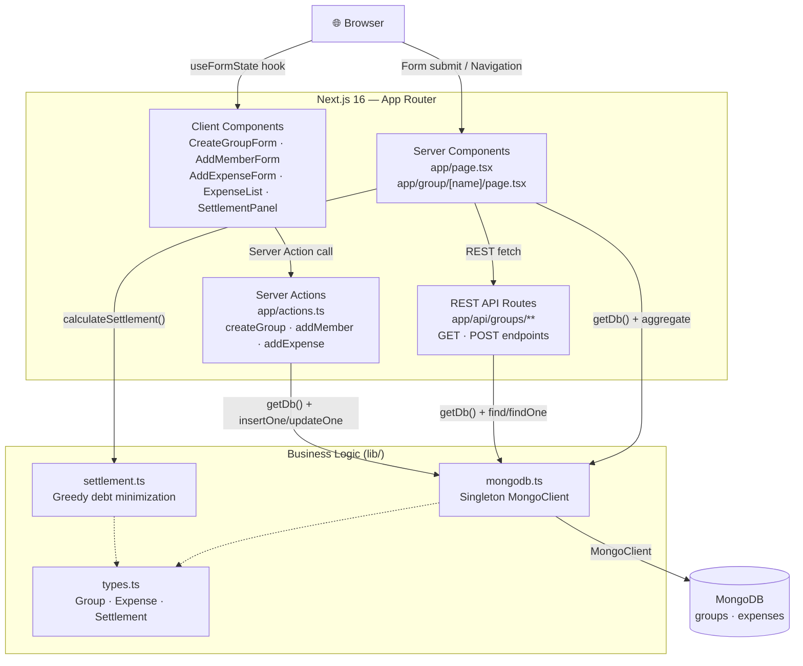
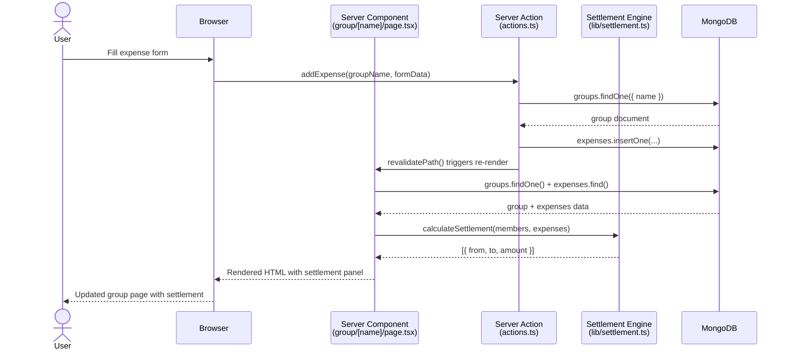

# Reparto de Gastos

A **Next.js 16 (App Router) + TypeScript web application** that lets groups of people track shared expenses and automatically calculates who owes whom to settle debts with the minimum number of transactions.

---

## Features Implemented

### 1. Group Management
Create named groups (slugified for URL-safety) stored in MongoDB with a unique index. Navigate to any existing group directly by name. Duplicate group names return a `409 Conflict` response.

### 2. Expense Tracking
Members can log expenses with a description, amount (€), and the person who paid. Expenses are linked to their group via `groupId` and sorted chronologically (most recent first).

### 3. Settlement Calculator
Greedy debt-minimization algorithm (`lib/settlement.ts`) that computes the minimum set of transfers needed to settle all balances. Each member's net balance is calculated from their paid share vs. equal share of total. Rounding is applied to 2 decimal places to avoid floating-point drift.

---

## Project Structure

```
expenses-distrib/
├── app/
│   ├── actions.ts                        — Server Actions: createGroup, addMember, addExpense
│   ├── page.tsx                          — Home page: create/navigate to group
│   ├── layout.tsx                        — Root layout with global styles
│   ├── globals.css                       — Tailwind CSS v4 global styles
│   ├── api/
│   │   └── groups/
│   │       ├── route.ts                  — POST /api/groups (create group)
│   │       └── [name]/
│   │           ├── route.ts              — GET /api/groups/:name
│   │           ├── members/route.ts      — POST /api/groups/:name/members
│   │           ├── expenses/route.ts     — GET/POST /api/groups/:name/expenses
│   │           └── settlement/route.ts   — GET /api/groups/:name/settlement
│   ├── components/
│   │   ├── CreateGroupForm.tsx           — Form to create a new group (Server Action)
│   │   ├── NavigateToGroup.tsx           — Input to jump to an existing group
│   │   ├── AddMemberForm.tsx             — Form to add a member to a group
│   │   ├── AddExpenseForm.tsx            — Form to log a new expense
│   │   ├── ExpenseList.tsx               — Renders the group's expense history
│   │   └── SettlementPanel.tsx           — Displays who owes whom
│   └── group/[name]/
│       ├── page.tsx                      — Group detail page (Server Component)
│       ├── loading.tsx                   — Suspense loading UI
│       ├── error.tsx                     — Error boundary UI
│       └── not-found.tsx                 — 404 for unknown groups
├── lib/
│   ├── mongodb.ts                        — MongoDB singleton client with lazy index creation
│   ├── settlement.ts                     — Greedy settlement calculation algorithm
│   └── types.ts                          — Shared TypeScript interfaces (Group, Expense, Settlement)
├── next.config.ts                        — Next.js configuration
├── tsconfig.json                         — TypeScript compiler config
└── package.json                          — Dependencies and scripts
```

---

## Architecture

### System Overview



### Main Flow: Add Expense → View Settlement



---

## Design Patterns / Architecture

- **Server Components** — `app/group/[name]/page.tsx` fetches MongoDB data directly on the server; no client-side data fetching or loading spinners for the main content.
- **Server Actions** — `app/actions.ts` uses `'use server'` for form mutations (`createGroup`, `addMember`, `addExpense`), with `revalidatePath` for cache invalidation after writes.
- **Singleton Pattern** — `lib/mongodb.ts` maintains a single `MongoClient` instance across hot-reloads in development via `global._mongoClientPromise`, avoiding connection pool exhaustion.
- **REST API layer** — Parallel route handlers under `app/api/` expose the same operations as Server Actions for programmatic access (e.g., curl, external integrations).
- **Greedy Algorithm** — The settlement engine uses two sorted queues (creditors/debtors) to produce the minimum number of transfer steps.

---

## How It Works

A user creates a group (e.g., `viaje-berlin`), adds members, and records expenses specifying who paid. The group page — a React Server Component — queries MongoDB, runs the settlement algorithm server-side, and renders the full UI in a single round-trip. When a form is submitted, a Server Action mutates the database and calls `revalidatePath` so Next.js re-fetches fresh data.

```typescript
// lib/settlement.ts — core algorithm
const share = total / members.length;          // equal split
const balance = paid[member] - share;          // positive = creditor, negative = debtor
// greedy: match largest creditor with largest debtor until all balanced
settlements.push({ from: debtors[j].name, to: creditors[i].name, amount: rounded });
```

---

## Architecture Decisions

Key architectural decisions are documented as ADRs in [`docs/decisions/`](docs/decisions/):

- [ADR-001: Next.js 16 App Router with Server Components](docs/decisions/ADR-001-nextjs-app-router.md)
- [ADR-002: MongoDB over PostgreSQL for expense groups](docs/decisions/ADR-002-mongodb-over-sql.md)
- [ADR-003: Server Actions for form mutations](docs/decisions/ADR-003-server-actions-mutations.md)
- [ADR-004: Greedy algorithm for debt minimization](docs/decisions/ADR-004-greedy-settlement-algorithm.md)

---

## AI-Assisted Development

This project was developed with [Claude Code](https://claude.ai/code) assistance.
A detailed critical review of AI-generated code, including what was modified and what was rejected,
is documented in [`docs/ai-review.md`](docs/ai-review.md).

Key changes from the AI draft:
- Added domain-specific input validation (slugify edge cases on group name)
- Fixed error handling for MongoDB duplicate key errors (code 11000 → user-friendly 409 message)
- Added member existence check before recording expenses (data integrity guard)

---

## Getting Started

### Prerequisites
- Node.js 20+
- A MongoDB instance (local or Atlas)

### Clone & Install

```bash
git clone https://github.com/Jorgeaapaz/MISEIA_1-4-70-expenses-distrib.git
cd MISEIA_1-4-70-expenses-distrib
npm install
```

### Environment Variables

Copy `.env.example` to `.env.local` and fill in real values:

```bash
cp .env.example .env.local
```

| Variable | Required | Description |
|---|---|---|
| `MONGODB_URI` | ✅ | MongoDB connection string (local or production) |
| `MONGODB_DB` | ✅ | MongoDB database name |

### Run

```bash
# Development
npm run dev

# Production build
npm run build
npm start
```

Open [http://localhost:3000](http://localhost:3000) in your browser.

---

## Production Deployment

The application is containerised with Docker and deployed on a GCP VM via GitHub Actions.
Full instructions are in [`docs/deploy.md`](docs/deploy.md).

```bash
# Build and run locally
docker build -t expenses-distrib .
docker run -p 3000:3000 -e MONGODB_URI=mongodb://localhost:27017 -e MONGODB_DB=expenses_distrib expenses-distrib
```

Auto-deploy: every push to `master` triggers the GitHub Actions `Deploy to GCP VM` workflow.

---

## Testing

```bash
# Run all tests once
npm test

# Watch mode (development)
npm run test:watch

# Run with coverage report
npm run test:coverage
```

Coverage report is generated in `coverage/` directory. Covers `lib/settlement.ts` (greedy algorithm edge cases) and `app/actions.ts` (input validation paths).

---

## Example Output

**Create a group and add members:**
```
POST /api/groups
Body: { "name": "Viaje Berlin" }
→ 201 { "name": "viaje-berlin" }

POST /api/groups/viaje-berlin/members
Body: { "memberName": "Alice" }
→ 200 { "success": true }
```

**Add expenses and get settlement:**
```
POST /api/groups/viaje-berlin/expenses
Body: { "paidBy": "Alice", "amount": 90, "description": "Hotel" }

POST /api/groups/viaje-berlin/expenses
Body: { "paidBy": "Bob", "amount": 30, "description": "Cena" }

GET /api/groups/viaje-berlin/settlement
→ 200 [{ "from": "Charlie", "to": "Alice", "amount": 40 },
        { "from": "Bob", "to": "Alice", "amount": 10 }]
```

**Edge case — single member or no expenses:**
```
GET /api/groups/solo-trip/settlement
→ 200 []   ← no transfers needed
```

**Duplicate group name:**
```
POST /api/groups
Body: { "name": "Viaje Berlin" }
→ 409 { "error": "A group with this name already exists" }
```
