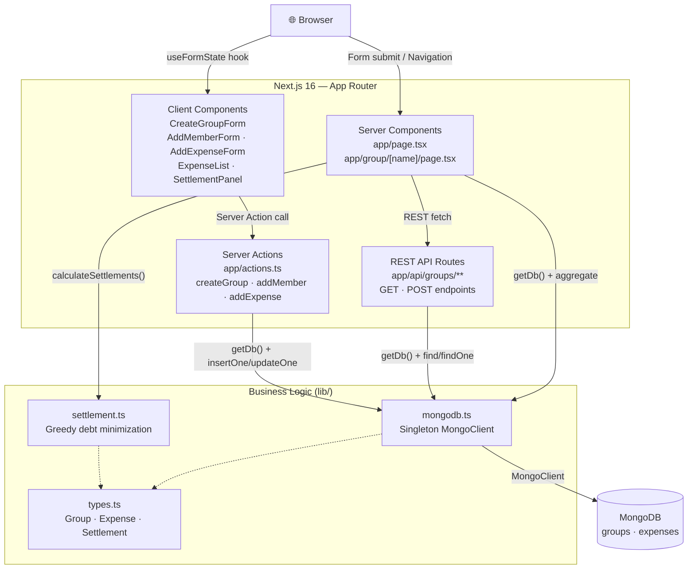
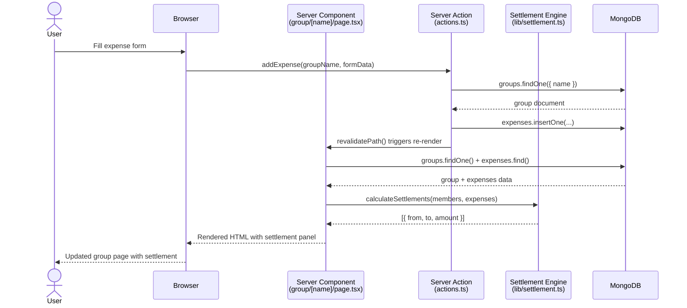

@~/.claude/prompts/new_functionality_prompt_spec.md

# Add Architecture Diagram (Mermaid) to README

## Role
Act as a Software Architect expert in Next.js App Router architecture, Mermaid diagrams, and technical documentation.

## Context
Project: `expenses-distrib` — Next.js 16 App Router + MongoDB expense splitting application.  
Location: `D:\Master-IA-Dev\04-Bloque4\1-4-70-expenses-distrib\expenses-distrib`

**Non-compliant criterion:** `dc_diagrama_arquitectura`  
> Architecture diagram (ASCII, Mermaid, draw.io) showing principal components and flows.

**Current state:**
- README has a folder tree (ASCII) but no component/flow diagram
- No visual representation of data flow (Client → Server Actions → MongoDB)
- No request/response cycle diagram

**Architecture to document:**
```
Browser → Next.js App Router → Server Components → MongoDB
         ↕ Server Actions (mutations)    ↑
         ↕ REST API routes               lib/settlement.ts
         ↕ React Client Components
```

Key components to diagram:
1. `app/page.tsx` — Home page (Server Component)
2. `app/group/[name]/page.tsx` — Group page (Server Component, fetches MongoDB directly)
3. `app/actions.ts` — Server Actions (createGroup, addMember, addExpense)
4. `app/api/groups/**` — REST API layer (parallel to Server Actions)
5. `lib/mongodb.ts` — MongoDB singleton client
6. `lib/settlement.ts` — Pure business logic (greedy algorithm)
7. `app/components/*` — Client Components (forms with useFormState)

## Task
1. Create a Mermaid architecture diagram showing the system architecture and data flows
2. Create a Mermaid sequence diagram for the main "add expense → view settlement" flow
3. Add both diagrams to `README.md` in a new "Architecture" section
4. Ensure diagrams render correctly in GitHub markdown (use `mermaid` code blocks)

### Diagram Guidelines
- Use `flowchart TD` for the system architecture overview
- Use `sequenceDiagram` for the main user flow
- Show all layers: Browser, Next.js (Server Components, Server Actions, API Routes), MongoDB
- Highlight the settlement algorithm as a separate business logic component
- Keep diagrams readable — max 15-20 nodes each

## Output Format

### Files to modify:
1. `README.md` — add "Architecture" section with two Mermaid diagrams

## Examples and Steps to Follow

**Step 1:** Add "Architecture" section to README after "Design Patterns" section:

**System Architecture Diagram:**
````markdown
## Architecture

### System Overview


````

**Sequence Diagram for main flow:**
````markdown
### Main Flow: Add Expense → View Settlement


````

**Step 2:** Commit and push:
```bash
git add README.md
git commit -m "docs: add Mermaid architecture and sequence diagrams to README"
git push
```

**Step 3:** Verify diagrams render on GitHub:
- Visit `https://github.com/Jorgeaapaz/MISEIA_1-4-70-expenses-distrib`
- Confirm both Mermaid diagrams render as visual charts (not code blocks)

## Output Checklist and Guardrails
- [ ] README has a dedicated "Architecture" section with at least 2 diagrams
- [ ] System architecture diagram shows all major components (Browser, Server Components, Server Actions, API Routes, MongoDB, Business Logic)
- [ ] Sequence diagram shows the "add expense → view settlement" flow end-to-end
- [ ] Both diagrams use Mermaid syntax (renders natively on GitHub)
- [ ] Diagrams are accurate to the actual code structure
- [ ] No placeholder or fake components in the diagrams
- [ ] Diagrams render correctly on GitHub (verify after push)
- [ ] Commit: `docs: add Mermaid architecture and sequence diagrams to README`
